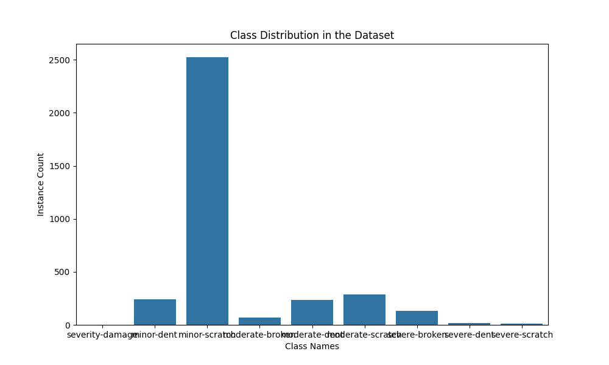
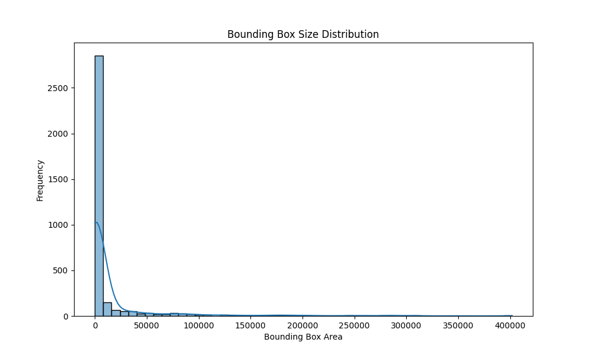
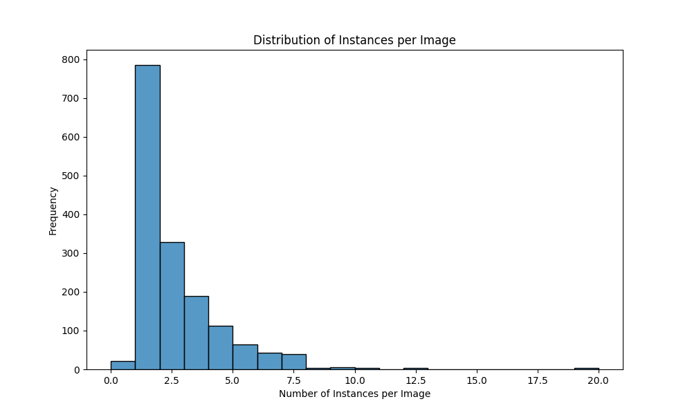
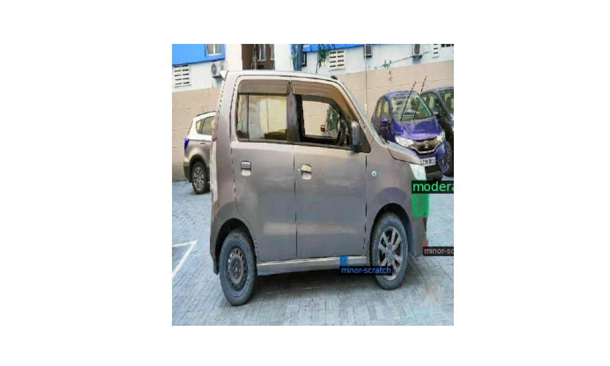
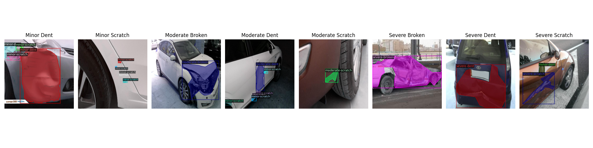
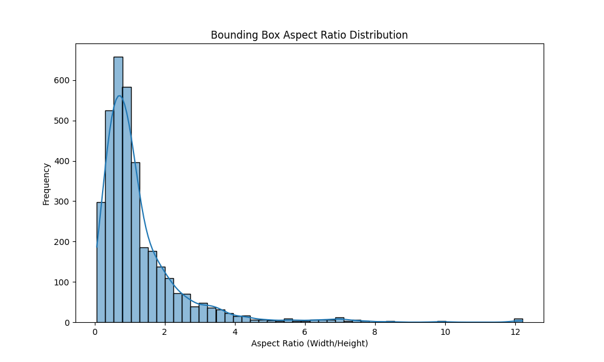
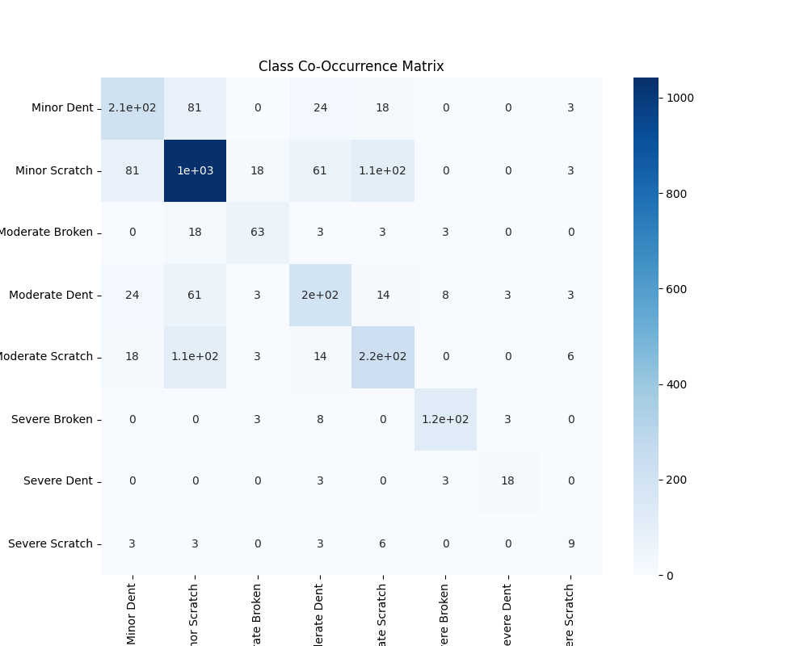
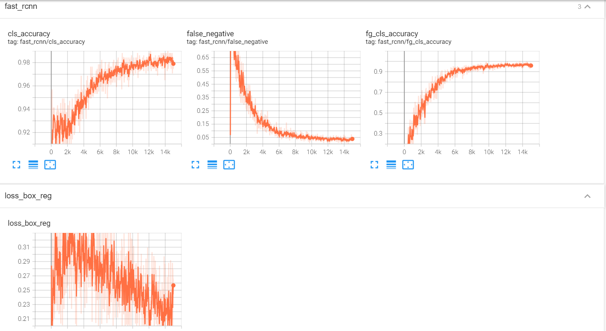

# Car Damage Detection: Model training and inference

## Project Overview

This repository contains a **car damage detection system** based on **Detectron2** using **Mask R-CNN**. The system is capable of detecting different types of damage to a vehicle and provides insights from exploratory data analysis (EDA). It also includes inference scripts to evaluate the model on test datasets, visualize the damage detected, and generate COCO-style evaluation metrics.

### Key Features
- **Mask R-CNN** based object detection model, trained to detect 8 classes of car damage.
- **FastAPI** for backend inference.
- **Streamlit** for front-end visualization of detected damage.
- **Dockerized** for deployment.
- **Exploratory Data Analysis (EDA)** to understand the dataset before training.

---
```commandline

## Project Structure

```bash
vehicle_damage_detection/
│
├── data/                               # Dataset directory
│   ├── train/                          # Training images
│   ├── val/                            # Validation images
│   ├── test/                           # Test images
│   ├── annotations/                    # COCO format annotation files
│       ├── instances_train.json        # Training set annotations
│       ├── instances_val.json          # Validation set annotations
│       ├── instances_test.json         # Test set annotations
│
├── output/                             # Directory for model checkpoints and logs
│   └── model_final.pth                 # Trained model weights
│
├── src/                                # Source code directory
│   ├── config/                         # Model and Detectron2 configurations
│       ├── mask_rcnn_R_50_FPN_3x.yaml  # Mask R-CNN configuration file
│   ├── exploratory_results/            # Folder containing EDA visualizations
│   ├── inference/                      # Inference scripts
│       ├── inference_evaluate.py       # Script for inference and evaluation on test set
│   ├── train.py                        # Training script
│   ├── evaluate.py                     # Evaluation script for validation set
│   ├── custom_loss.py                  # Implementation of custom loss (e.g., focal loss)
│   ├── utils.py                        # Utility functions (e.g., data visualizations)
│   └── config.py                       # Model configuration setup
│
├── vehicle_dd/                         # Deployment folder
│   ├── app/                            # FastAPI and Streamlit deployment
│   ├── Dockerfile                      # Dockerfile for deployment
│   └── README.md                       # Deployment-specific readme
│
├── README.md                           # Main project documentation
├── requirements.txt                    # Python dependencies
└── .gitignore                          # Gitignore file

```
### Why Detectron2?

**Detectron2**, developed by Facebook AI Research (FAIR), is a high-performance and modular framework for object detection, segmentation, and other computer vision tasks. We selected Detectron2 because:

- **Modularity**: Detectron2 allows easy experimentation with different detection models, backbones, and loss functions. This made it easy to implement **Focal Loss** to handle the class imbalance in our dataset.
- **State-of-the-Art Implementations**: Detectron2 provides state-of-the-art object detection models like Faster R-CNN, Mask R-CNN, RetinaNet, etc., making it suitable for quickly iterating and trying out different models.
- **Ease of Use**: The framework is well-documented, and it is straightforward to register custom datasets (e.g., in COCO format) and modify key components of the model.
- **Optimized for Performance**: Detectron2 is built with performance in mind, providing optimized training loops, multi-GPU support, and fast inference. This allows for scalable training and fast iteration.
- **Visualization Tools**: Detectron2 includes built-in visualization tools, which made it easy to visualize the results of inference and to debug annotations and predictions.

---

## Model Choice: Mask R-CNN with Detectron2

### Why Mask R-CNN?

Mask R-CNN is a powerful instance segmentation model that extends Faster R-CNN by adding a branch for predicting segmentation masks on each Region of Interest (RoI). It is well-suited for object detection tasks where not only bounding boxes are required but also pixel-wise segmentation, making it a perfect fit for detecting different types of car damage. Here’s why we chose **Mask R-CNN**:

- **Instance Segmentation**: Car damage detection benefits from instance segmentation, as we want to localize specific regions of damage (scratches, dents, etc.).
- **Multi-Class Detection**: Mask R-CNN supports multiple classes, which aligns with our problem of detecting different damage types (e.g., minor scratch, severe dent).
- **Flexibility in Backbone**: Mask R-CNN allows flexibility in choosing the backbone architecture (e.g., ResNet-50) for feature extraction, making it adaptable for various complexities of the dataset.


## Exploratory Data Analysis (EDA)

Before diving into the model training, we conducted an **Exploratory Data Analysis (EDA)** to better understand the dataset. EDA helps us uncover patterns, identify outliers, and get insights into the distribution of the data, which can guide the model training process.

### Dataset Overview

- **Dataset Format**: The dataset is in **COCO format** and consists of images annotated with bounding boxes and class labels for various types of car damage.
- **Classes**: The dataset contains 8 damage classes:
  1. Minor Dent
  2. Minor Scratch
  3. Moderate Broken
  4. Moderate Dent
  5. Moderate Scratch
  6. Severe Broken
  7. Severe Dent
  8. Severe Scratch

- **Number of Images**: The dataset is split into **train**, **validation**, and **test** sets.

### Key Exploratory Data Analysis Steps

We performed several analyses on the dataset to guide the training process. Below are the key EDA steps, with example images saved under `src/exploratory_results/`:

### 1. **Class Distribution**

We analyzed the number of instances per class to understand class imbalance. The result showed a significant imbalance, with classes like "Minor Dent" and "Minor Scratch" being more prevalent than "Severe Dent" or "Moderate Broken." This analysis helped in deciding to use **Focal Loss** to handle the imbalance during training.

Example plot:  


### 2. **Bounding Box Size Distribution**

We analyzed the sizes of bounding boxes (area in pixels) to understand the size variations of damage instances across the dataset. The bounding boxes had a wide range of sizes, which implies that the model must handle both large and small instances effectively.

Example plot:  


### 3. **Instances per Image**

We analyzed how many damage instances are annotated per image. Most images contain only one or two instances of damage, which aligns with typical car damage scenarios. This analysis helped us determine the number of predictions the model should make per image.

Example plot:  


### 4. **Sample Images with Annotations**

We visualized a few sample images with their annotations to ensure that the annotations are correct and properly formatted. This step helped in verifying that the data preprocessing and dataset registration in Detectron2 were correctly done.

Example visualization:  


### 5. **Visualizing One Image per Class**

We ensured that we had at least one sample image for each class by visualizing one image per class with annotations. This was useful to ensure that each class was properly represented in the dataset.

Example visualization:  


### 6. **Bounding Box Aspect Ratio Distribution**

We also visualized the aspect ratio (width/height) of bounding boxes to understand the shape of damage regions. This analysis helps the model learn to detect damages of varying shapes (long scratches, wide dents, etc.).

Example plot:  


### 7. **Class Co-Occurrence Matrix**

We created a class co-occurrence matrix to see if multiple types of damage frequently appear together in the same image. Understanding class co-occurrence can guide model architecture decisions or post-processing strategies for multi-class predictions.

Example heatmap:  


---

## Inference from the EDA

The insights derived from the EDA shaped the following decisions:

1. **Focal Loss for Class Imbalance**: The class imbalance analysis showed that some classes had significantly fewer examples, which prompted us to use **Focal Loss** to ensure that the model focuses on harder-to-detect classes.
  
2. **Handling Varying Box Sizes**: The distribution of bounding box sizes indicated that we needed a model (like Mask R-CNN) that handles varying object sizes well.

3. **Augmentation Strategies**: Based on the dataset analysis, we applied **data augmentation** techniques (e.g., flipping, scaling) to improve the model’s generalization capability on different damage shapes and sizes.

4. **Multi-Class Predictions**: The co-occurrence matrix showed that multiple types of damage can appear together, guiding us to allow the model to predict multiple classes for the same image.

---

## Visual Results

All visual outputs from the EDA are saved in the `src/exploratory_results/` folder. 

## Model Training

### Key Features of the Training Script
1. **COCO Dataset Registration**:  
   The datasets (training, validation, and test) are registered in COCO format using `register_coco_instances()`.

2. **Custom Focal Loss**:  
   The Focal Loss is used as the loss function for the **ROI heads**:
   
3. **Tensorboard Logging**:
The training process is logged using TensorboardXWriter, which can be visualized in Tensorboard to track metrics like loss, mAP, and more.

4. **COCO Evaluator**:
The COCOEvaluator is used for validating the model’s performance on the validation set and test set.

### Train

*   **Register Datasets**:Ensure the COCO-format datasets are registered before training begins. The script handles this automatically using:
    
*   ```register\_coco\_instances("vehicle\_train", {}, "data/annotations/instances\_train.json", "data/train")```
    
*   ```python src/train.py```
    
*   **Parameters**:
    
    *   **Number of Classes**: The model is trained on 8 damage classes (ignoring the background class).
        
    *   **Model Device**: Set to **cuda** for GPU-based training.
        
    *   **Evaluation Period**: Evaluates the validation dataset every 2000 iterations.

### Model Inference
    
* The inference pipeline allows you to test the trained model on single images or evaluate the entire test dataset to generate COCO-style metrics.
    
    
* **Load the Model**: Load the trained weights from the specified directory (output).
    
* **Run Predictions**: Perform inference on the image to detect damage and predict class labels and bounding boxes.
    
* **Visualization**: The results are saved as an annotated image with bounding boxes.
    
* ```python src/inference/inference_evaluate.py ```
    
* The results are saved to a JSON file, which contains metrics like mAP, AP50, AP75, and others (inference/putput/coco_instances_results.JSON).

### Training Challenges

1. **Incomplete Training**: Due to time constraints, the model was not fully trained. The training process was cut short, resulting in suboptimal performance. To improve the model's accuracy, more training epochs and better hyperparameter tuning are essential.
   
2. **Class Mapping in Detectron2**: Detectron2 has specific ways of mapping class annotations during training. The background class was set with an **ignore index of 0**, but this was not initially handled correctly, leading to misaligned class predictions. This should be fixed to ensure consistent class mappings during training and inference.


### Training Logs and Tensorboard

Training logs are generated and can be viewed using Tensorboard. The log files include (inside output folder):
- **CommonMetricPrinter**: Console logs.
- **JSONWriter**: Metrics are written to `metrics.json` for offline analysis.
- **TensorboardXWriter**: Logs for **Tensorboard** to monitor training and evaluation.



## Future Improvements

- **Improved Augmentation**: We could add more aggressive augmentation techniques like rotation, perspective changes, or color jittering to make the model more robust.
- **Hyperparameter Tuning**: More experiments with learning rates, batch sizes, and backbone architectures could further improve the model's performance.
- **Handling Severe Class Imbalance**: Consider oversampling underrepresented classes or using more advanced loss functions like **OHEM (Online Hard Example Mining)**.
- **Data Annotation Improvement**:  add more data to underrepresented classes.

---
### Future Model Improvements
#### YOLOv5 for Real-time Prediction
For real-time damage detection, YOLOv5 can be a better alternative as it provides faster inference times while maintaining good accuracy. YOLOv5 is well-suited for real-time applications due to its optimized architecture and can be used for tasks like real-time damage estimation.

#### Why YOLOv5?

* Speed: YOLOv5 is faster than most object detection models, making it ideal for real-time applications.
* Performance: Despite its speed, it performs well on smaller objects like scratches and dents, which are critical in vehicle damage detection.
### Two-stage Object Detection Pipeline
A two-stage object detection pipeline could be designed where:

The first stage detects the damage region (e.g., car body part).
The second stage classifies the damage into specific categories like minor dent, minor scratch, etc.
This can improve precision by isolating damage areas before classifying them into specific types. Crop-based detection can also help focus on localized damage and improve classification accuracy.

####Possible Advantages:

Better localization of damage regions.
Higher accuracy for differentiating between fine-grained damage types (e.g., minor vs. severe damage).

